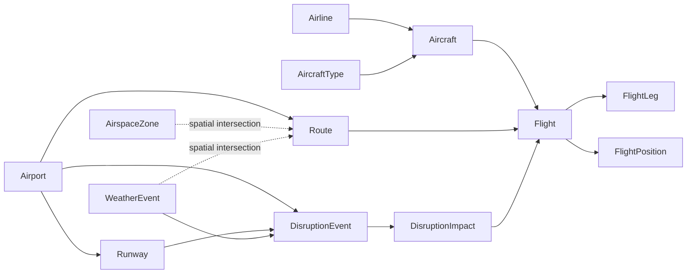

# AeroPulse

**A Spatio-Temporal Aviation Network Intelligence and Decision Support System**

A shared, database-backed aviation operations demonstrator. React and Leaflet render the operational picture; PostgreSQL/PostGIS computes spatial relationships, persists movement history, and stores reversible disruptions. Neo4j optionally projects aircraft rotations for graph traversal.

Traffic, weather, airspace and operational estimates are **synthetic demonstrations**, not live operational advice or navigation data. Airport coordinates and runway dimensions are approximate reference values, not a certified airport dataset.

## Run

Requirements: Python 3.12–3.14, Node.js 22.12+ (or 24), PostgreSQL 17+ with PostGIS, and an optional Neo4j Aura database.

```sh
python -m venv .venv
# Windows: .venv\Scripts\activate
# macOS/Linux: source .venv/bin/activate
pip install -r requirements-dev.txt
npm ci
cp .env.example .env
# Set DATABASE_URL to a dedicated PostGIS database.
python -m scripts.setup
python -m uvicorn backend.main:app --port 8000
```

In a second terminal, `npm run dev`. Vite proxies `/api` to the development API. Production uses same-origin `/api`; no production request depends on localhost. `python -m scripts.setup` runs Alembic migrations, idempotent demo seeding and optional graph synchronization. It never drops existing user data or replaces an existing seed.

For restricted Windows environments where esbuild cannot inspect parent directories, use `npx vite build --configLoader native` or `npm run preview -- --port 5173 --configLoader native` with Node 24.

## Production

Deploy the repository root to Vercel. `vercel.json` builds the Vite frontend and packages `api/index.py` as the FastAPI function, with SPA and `/api/*` routing. Runtime dependencies are declared in both `requirements.txt` and `pyproject.toml`.

1. Provision a managed PostgreSQL/PostGIS database (Supabase is supported).
2. Enable PostGIS with an administrator. Use a dedicated application database role with `CONNECT` and `USAGE, CREATE` on the application schema for migrations; it owns the 13 tables. The backend uses a session pooler on port 5432 with SSL and short-lived connections.
3. Configure the backend variables below. Keep Supabase's Data API disabled when using this direct SQL architecture, or restrict exposure with RLS and grants.
4. Run `python -m scripts.setup` once against that database before deploying. Subsequent releases use `alembic upgrade head`. Migrations are not run by public requests.
5. `vercel --prod`. No browser database keys or storage are needed.

| Variable | Purpose |
| --- | --- |
| `DATABASE_URL` | Required backend PostGIS connection. Accepts `postgresql://` or `postgresql+psycopg://`. For Supabase session pooling, use the displayed pooler user/host and `?sslmode=require`. Percent-encode the password. |
| `DATA_MODE` | `demo` (default) or `live`. Live without provider credentials explicitly falls back to demo. |
| `CORS_ORIGINS` | Comma-separated origins allowed for a separate frontend. Same-origin deployment needs no cross-origin permission. Never use wildcard production origins. |
| `ADMIN_TOKEN` | Optional bearer token for mutations. Unset in the intentionally shared public demo. Required outside demo mode. Never expose in `VITE_*`. |
| `NEO4J_URI`, `NEO4J_USER`, `NEO4J_PASSWORD` | Optional Aura connection, usually `neo4j+s://…`. Missing or unavailable Neo4j uses PostgreSQL recursive dependency analysis. |
| `OPENSKY_CLIENT_ID`, `OPENSKY_CLIENT_SECRET` | Optional server-only OpenSky OAuth credentials. |
| `CRON_SECRET` | Bearer secret for `/api/tracking/tick` when an external scheduler invokes it. |
| `VITE_API_URL` | Optional separate backend origin (without `/api`). Leave empty on Vercel for same-origin requests. This is the only frontend environment variable. |

Credentials and `.env` files are gitignored. Public demo mutations affect the shared demonstration database, are limited to 20 concurrent events, reject duplicate active scenarios, and retain resolution history. For a private operational installation, set `ADMIN_TOKEN` and place an authenticated operator gateway in front of mutation endpoints; the public demonstration UI deliberately contains no privileged token.

## Data model

Exactly **13 core relational entities**: `airport`, `airline`, `aircraft_type`, `aircraft`, `route`, `flight`, `flight_leg`, `runway`, `weather_event`, `airspace_zone`, `disruption_event`, `disruption_impact`, `flight_position`. Alembic's version table and PostGIS extension metadata are infrastructure, not additional domain entities.

`backend/models.py` declares keys, foreign keys, uniqueness and domain checks. `migrations/versions/0001_initial.py` freezes the initial DDL independently of future model edits. Spatial fields use SRID 4326 with POINT, POINTZ, LINESTRING and POLYGON types. GiST indexes cover every geometry and extra geography expressions used by radius queries; B-tree indexes cover schedules, assignments, statuses and position/disruption timestamps.



## Tracking and spatial intelligence

The initial seed contains 12 Indian airports, four airlines, four aircraft types, 32 aircraft, 132 routes, 128 flights, runways, minute-by-minute historical positions, a weather polygon, and a military training zone.

Demo movement interpolates in **PostGIS**. Each map refresh calls a transaction-locked tick: all visitors share one ten-second time bucket, and `UNIQUE(flight_id, recorded_at)` prevents duplicate samples. Position rows are inserted before current aircraft state is updated. Scheduled flights transition through `EN_ROUTE` to `LANDED`; exhausted aircraft receive fresh synthetic rotations with new flight IDs, preserving old history. A returning idle demo resumes with aircraft distributed along routes. Scenario delays are analytical estimates; they do not alter the nominal movement timeline.

An open application persists demand-driven updates every ten seconds. `python -m scripts.worker` or an authenticated scheduler provides continuous sampling while nobody is browsing. Serverless invocations do not depend on an in-memory background loop. Replay returns at most 1,500 actual recorded samples with cursor pagination; gaps while no worker/viewer is active remain genuine gaps. High-resolution history is retained for seven days and cleaned in bounded batches.

PostGIS implements radius search (`ST_DWithin`), nearest/alternate airports and remaining distance (`ST_Distance` on geography), polygon-route intersections (`ST_Intersects`), inside-weather detection (`ST_Contains`), weather approach screening within 150 km, horizontal/vertical flight proximity, `ST_Buffer` impact zones, and GeoJSON serialization. Altitudes are in **meters**, ground speeds in **km/h**, headings in **degrees**, and timestamps are UTC. Approach screening uses the remaining direct segment, not a certified flight plan. Route airspace screening includes the latest known altitude when available.

Map state uses a set-based join with indexed lateral latest-position lookups and aggregate factors, rather than a separate query per flight. It returns current flight records, not full tracks, and is bounded to 500 flights from a rolling recent window. This is sized for the demonstration network; a larger deployment should use viewport paging and separate map/reference-data refreshes.

## Explainability and disruption lab

Risk is a deterministic sum capped at 100. `HIGH ≥ 50`, `MODERATE ≥ 20`, otherwise `LOW`. The response includes every contributing rule, its points and its explanation. Weather severity contributes 7 points per level, being inside adds 10 (approaching adds 5), airspace adds 22, destination/origin closure adds 50/35, runway closure adds 25, a turnaround below 40 minutes adds 12, downstream aircraft unavailability adds 25, and estimated delay of at least 45 minutes adds 15. Landed/cancelled flights have no current operational risk. Scores are rules, not calibrated probabilities.

Runway closure, airport closure and severe-weather simulations create real `disruption_event` and `disruption_impact` rows atomically. Direct flights are selected by schedules, airport relationships or spatial intersection. Delay estimates use severity and event duration. Arriving flights facing a closure receive diversion risk; downstream aircraft rotations propagate delay after available turnaround buffer above a 25-minute minimum. Several open runways can mitigate capacity loss but this demonstrator conservatively flags a runway closure for further review.

Alternate candidates must be operational, have an open runway of at least 2,200 m, lie within 650 km of the destination, and have no active airport/runway closure affecting the candidate runway. Ranking is geographic distance, not an operational landing clearance. Fuel, aircraft performance, landing minima and diversion weather require separate validation.

Resolving a demo event closes its impacts and its generated weather polygon. Baseline infrastructure is never overwritten, so overlapping scenarios remain independent. Naturally expired events no longer contribute to analysis. The UI presents direct flights, downstream paths, delay estimates and alternatives on the map.

## Graph and copilot

`python -m scripts.sync_graph` initializes Neo4j uniqueness constraints and synchronizes only operational Airport, Flight, Aircraft and Disruption projections. Nodes are namespaced `AeroPulse*`; relationships are `DEPARTS_FROM`, `ARRIVES_AT`, `USES_AIRCRAFT`, `NEXT_FLIGHT` and `AFFECTS`. Graph changes are transactional. PostgreSQL remains the source of truth. Cascades return root, target, path, depth, remaining delay and reason. Missing Neo4j credentials or connection errors fall back to an equivalent recursive SQL traversal. A selected flight without impacts uses an explicitly labeled 90-minute what-if; the network-wide endpoint uses persisted disruption delays.

The operations copilot recognizes a small, documented set of intents: high risk, weather exposure, city/airport disruption impacts, alternate airports, restricted airspace intersections and downstream impacts. Every answer uses database queries. Unsupported questions return examples rather than invented answers. See `backend/copilot.py` for the modular intent handler.

## Live provider

`backend/providers.py` defines the provider interface and an OpenSky OAuth adapter with timeouts, server-side credential handling, and persisted observations. It ingests only callsigns mapped to known active flights and aircraft, converts speed to km/h, and preserves provider timestamps. It does not fabricate airlines, routes or flights from anonymous aircraft states.

For a real-data deployment, use a separate database, load authoritative reference data/schedules/assignments, set `DATA_MODE=live` and the provider credentials, then run the worker. Setup skips synthetic seeding in effective live mode. Provider outages retain the last observations; timestamps expose staleness. Do not mix a demo schedule database with live surveillance and claim the resulting analysis is real operations.

## API

Interactive OpenAPI documentation is available from FastAPI at `/docs` when running the backend directly. In the public Vercel deployment, use `/api/docs` and `/api/openapi.json`.

All application endpoints are under `/api`: health; airports/nearby/alternates; airlines; aircraft/types; routes; flights/detail/positions/risk/alternates/proximity; weather; airspace; runways; disruptions/list/detail/impacts/simulate/resolve; intelligence/network/high-risk/cascade; copilot/query; map/state; and authenticated tracking/tick. Invalid parameters return 422, missing records 404, duplicate scenarios 409, and database outages 503 without credential details.

## Verification

```sh
python -m compileall -q backend api scripts migrations
ruff check backend api scripts tests
# TEST_DATABASE_URL must reference a dedicated disposable, migrated/seeded PostGIS database.
pytest -q
npm run lint
npm run build
npx playwright install chromium
# Start the backend on :8000 before browser tests.
npm run test:e2e
```

Unit tests cover schema count, input validation, risk rules and live fallback. Integration tests use real PostGIS to verify seed idempotence, indexes, movement persistence/replay, spatial queries, copilot answers, all three simulations, cascade paths, reset and timetable replenishment. Browser tests use the real API for flight selection, replay, overlays, alternates, cross-page persistence, mobile controls and copilot results. CI starts a disposable PostGIS service and runs these checks; integration tests skip explicitly if `TEST_DATABASE_URL` is absent.

Map tiles are OpenStreetMap with visible attribution. The site uses IBM Plex fonts and Lucide icons; no proprietary flight-tracker assets are copied.

